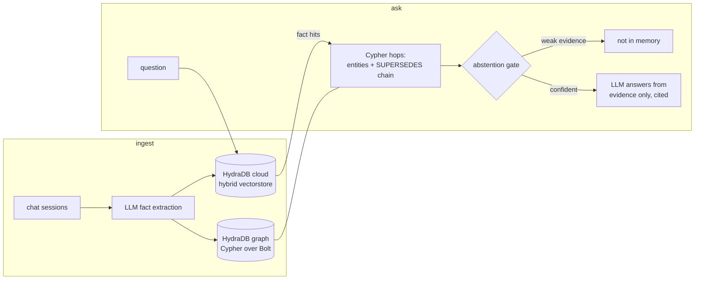

# Engram

Long-term memory for AI agents, built on HydraDB. Hack Hydra 2026, Track 3 (Memory and Context Retrieval).

Agents forget everything between sessions. Worse, plain vector retrieval remembers wrong: it retrieves by similarity, so an outdated fact ("I live in Austin") scores just as well as the current one ("I moved to Denver"). Engram ingests past chat sessions into a HydraDB knowledge graph where facts are versioned, answers new questions using only what it remembers, cites the session each fact came from, and says "not in memory" instead of guessing.

Any agent can bolt this on as its memory layer.

## Architecture



Graph schema: `Session {sid, date}`, `Entity {name, type}`, `Fact {statement, confidence, valid_from, valid_to}`, with edges `(Fact)-[:ABOUT]->(Entity)`, `(Fact)-[:FROM]->(Session)`, `(Fact)-[:SUPERSEDES]->(Fact)`.

## Where HydraDB does real work

1. The knowledge graph is a HydraDB graph node (the open source Rust engine), queried over Bolt with OpenCypher at ingest time and on every question. The SUPERSEDES chain walk that picks the currently true version of a changed fact is a live Cypher traversal, not app logic over cached data.
2. Fact text lives in the HydraDB cloud hybrid vectorstore (semantic + BM25). Every question starts as a hybrid query there; hits carry graph fact ids back for the Cypher hop.
3. Facts carry `valid_from` / `valid_to`, set through Cypher when a newer fact supersedes an older one. That gives time travel: `engram ask --as-of 2026-05-01` answers with what was true then.

The `--mode vector` flag turns the graph off and answers from similarity alone. That is the ablation: the difference between the two modes is HydraDB's graph earning its keep.

## Setup

```bash
python -m venv venv && source venv/bin/activate
pip install -r requirements.txt && pip install -e .
cp .env.example .env    # add your keys, see below
bash scripts/hydradb-local.sh    # local HydraDB node, keep it running
engram smoke    # proves cypher write/update/read/delete works
```

Keys in `.env`:
- one LLM key, any of `ANTHROPIC_API_KEY`, `OPENAI_API_KEY`, `OPENROUTER_API_KEY`, `NVIDIA_API_KEY` (free at build.nvidia.com)
- `HYDRA_DB_API_KEY` from app.hydradb.com for the hybrid vectorstore. Without it Engram falls back to a small local BM25 over the fact log, clearly not the real thing, but the repo stays runnable.

## Use

```bash
engram ingest                          # the 3 sample sessions in data/sample_sessions
engram ask "what's my dog's name?"     # cited answer
engram ask "where do I live?" --mode vector   # the stale austin answer
engram ask "where do I live?"                 # graph mode follows SUPERSEDES to denver
engram ask "where do I live?" --as-of 2026-05-01   # time travel: austin again
engram ask "what's my favorite food?"  # not in memory
engram serve                           # same thing in a browser, localhost:8080
```

## Eval

20 questions from LongMemEval (oracle variant): 4 knowledge-update, 4 multi-session, 4 single-session, 3 temporal-reasoning, 5 abstention. Built reproducibly by `eval/build_subset.py`.

```bash
python eval/build_subset.py
engram ingest --dir data/longmemeval_sessions
engram eval
```

Results land in `eval/results.json`: accuracy per mode (graph vs vector ablation), the abstention breakdown (correct, wrong, right-abstain, wrong-abstain, hallucination), latency, and an abstention gate sweep across thresholds. Numbers from the submission run go here once final.

The abstention gate is one tunable number, `ENGRAM_ABSTAIN_THRESHOLD`. Below it, Engram refuses to answer before the LLM is even called.

## Tests

```bash
pytest tests/   # needs the local hydradb node running
```

Covers the supersedes chain walk, the as-of filter, vector mode returning the stale fact, and the abstention gate.

## Limitations

- Entity linking is naive, exact name match. "my sister" and "Nora" only merge if the extractor names them the same way.
- Supersede detection is an LLM judgment per session, it can miss subtle contradictions.
- The local HydraDB engine speaks a strict OpenCypher subset (integer node ids, one hop write patterns), so ingestion allocates ids from a local registry file.
- Eval is 20 questions, enough to show the shape, not a leaderboard claim.
